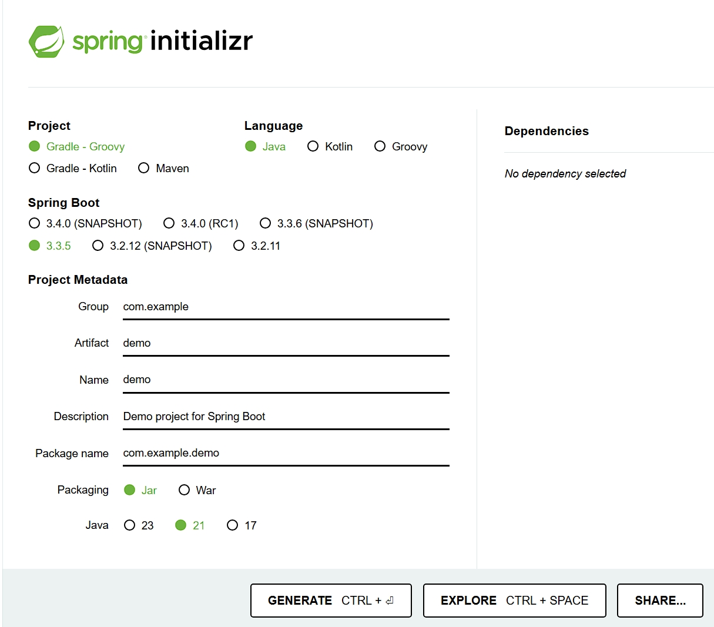
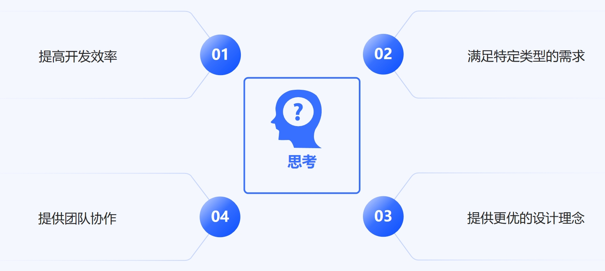
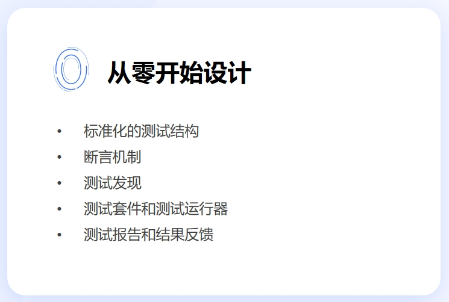
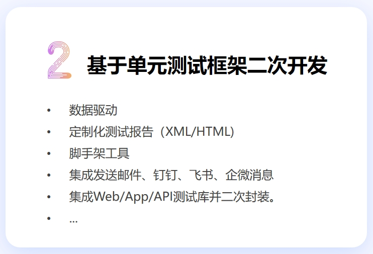
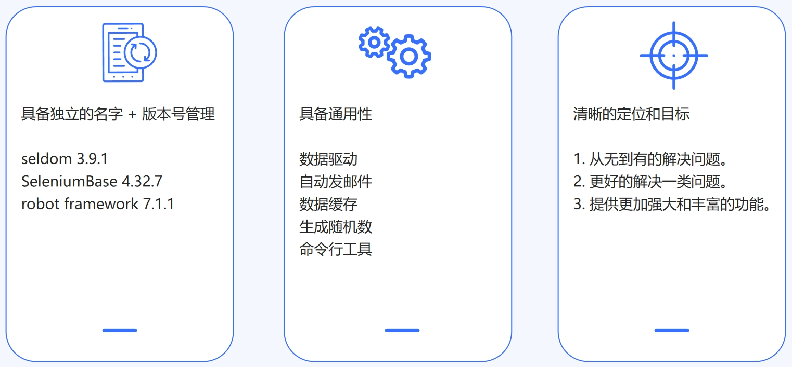
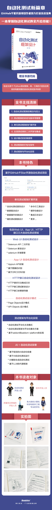

# 一文搞懂如何设计自动化测试框架

## 什么是自动化项目搭建

当一个软件开发工程师接到一个新的Web项目开发的时候，往往需要完成一些准备工作，例如，选择web框架，项目的目录结构设计，数据库的连接配置，Redis/Kafka连接和配置；甚至包括一些基础功能的实现和封装，例如 MySQL库增删查改操作的封装，登录功能，以及登录token的验证。这个过程通常称为 __项目初始化__ 或 __项目搭建__。

当我们的大部分项目都会用到这些基础功能，我们会将这个搭建好的项目放到一个单独的代码仓库，当需要开发新的项目时就从从这个仓库拉取代码，在这个项目代码的基础上继续开发。这项目通常被称为 __种子项目__ 或 __模板项目__。

每次从模板项目拉取代码，都需要手动修改 `模板项目` 的名称，例如：将 `template-project` 改为 `company-user-project` 或 `company-payment-project`。甚至在使用 `模板`项目的时候，会有个性化的需求，`compay-user-project` 需要使用MySQL数据库，`comany-payment-project`需要使用MongoDB数据库，我们可以进一步实现脚手架工具。通过可选配置的方式生成个性化的 `模板项目` ，这样的工具我们通常称为 __脚手架工具__。

图：Spring initizlizer

自动化测试工程师在接到新需求时，也需要完成类似项目初始化的工作（例如选择测试框架、设计目录结构、集成测试报告，以及各种主流的测试库等）。此外，也包括实现一些基础用例或封装一些通用操作，比如系统的注册、登录用例，封装随机数的生成等等。毫无疑问，这个过程也被认为是 __自动化项目搭建__

当我们搭建好了自动化测试项目，同样可以将其作为 __模板项目__ 使用。然后，基于 `模板项目`，我们可以更加快速的编写自动化测试用例。

为什么要介绍这个概念，是因为网上看到大量的文章将 __自动化测试项目搭建__ 叫做 __自动化测试框架开发__，这显然是错误的认知，因为两者的角度和目的是不同的。

* 自动化测试项目搭建： 服务于公司具体业务，为了更快速地编写业务的测试用例。

* 自动化测试框架开发： 为了解决一类通用问题，开发设计的一种通用的能力，从而定义解决问题的方法和结构。

## 为什么设计自动化测试框架

开发框架的原因可以有多种角度，以下是比较常见的原因。

### 提高开发效率

现有框架可能存在以下问题：

- 现有框架使用过程中存在过多的第三方依赖，安装和配置比较繁琐。
- 使用复杂，测试工程师需要花费过多时间学习或适配。

通过开发更贴合需求的自动化测试框架，可以减少重复性劳动，提升开发效率。

### 满足特定类型需求

现有框架存在无法满足特定类型的业务的测试需求（例如，gRPC、Kafka的测试用例编写），需要在现有框架的基础上做更多的功能扩展和封装。

通过开发功能更加强大的框架，更好的解决现有业务类型的自动化测试需求。

### 提供更优的设计理念

提供更优的设计理念或创新技术实现。

- 创新性设计：基于新的架构或设计模式提供更高性能、更易扩展的解决方案。
- 领域驱动：专注于某一特定领域（如关键字驱动，数据驱动、方法链）的最佳实践。

### 提升团队协作

规范团队协作，提升开发体验和代码一致性。

- 框架可以规范团队的开发方式，减少个性化差异带来的协作成本。
- 提供标准化的工具链、模块和流程，确保团队代码质量和一致性。

## 自动化测试框架设计的方向

当我们决定去设计自动化测试框架，那么可以有两个方向：__从零开始设计__ 和 __基于单元测试框架二次开发__

### 从零开始设计

从零开始设计自动化测试框架，例如针对一款的编程语言，单元测试框架一般需要作为基础库被设计并集成到编程语言中。

#### 标准化的测试结构

单元测试框架提供了一种统一的结构化方式，让开发者以一致的方式组织和运行测试。

* __生命周期方法__: 通常框架会定义一套标准化的生命周期钩子，用于在每个测试方法执行前后进行资源管理：`setup/beforeEach`: 在每个测试运行之前初始化测试环境（如创建测试数据、实例化对象）。
`teardown/afterEach`: 在每个测试运行后清理资源（如关闭数据库连接、删除临时文件）。

* __测试方法的命名__: 通常有特定约定，比如以 `test_` 开头（Python 的 unittest）或 `@Test` 注解（Java 的 JUnit）。 这种约定使得框架可以自动发现测试方法。

* __独立性__: 每个测试方法应保持独立，不依赖其他测试。测试之间的隔离有助于更快定位问题。

#### 断言机制

断言（Assertions）是单元测试的核心，用于验证被测代码的行为是否符合预期。

__断言的作用:__

1. 通过对输入和输出的验证，确保代码逻辑正确。
2. 如果断言失败，测试会立即终止并报告错误。

#### 测试发现

测试发现是单元测试框架的一项重要功能，能够自动找到符合规范的测试。

框架会扫描特定的模块或文件夹，找到符合命名约定的方法。例如：在 Python 中，pytest 会自动发现以 `test_` 开头的方法。在 Java 的 JUnit 中，`@Test` 注解标识的方法会被识别为测试方法。

#### 测试套件和测试运行器

测试套件和运行器使得开发者可以高效地组织和执行测试。

* __测试套件（Test Suite）__

测试套件是一个集合，用于将多个测试用例组合在一起运行。方便地对一组相关的测试进行分组管理。

* __测试运行器（Test Runner）__

测试运行器负责执行测试并收集测试结果。

#### 测试报告和结果反馈

测试报告用于展示测试的执行结果，帮助开发者快速了解代码的健康状态。测试结果分类

* 通过（Pass）: 测试正常完成且所有断言成功。
* 失败（Fail）: 测试未通过，某个断言失败。
* 错误（Error）: 测试执行过程中抛出了未预期的异常。
* 跳过（Skip/Ignore）: 测试因某些条件未被执行。

> 扩展：xUnit 被认为是许多主流编程语言的单元测试框架的雏形和灵感来源。xUnit 是一种架构模式，最早由 Kent Beck 和 Erich Gamma 在 SUnit（Smalltalk 的单元测试框架）中提出，并成为了测试框架设计的标准。其设计思想和概念被广泛应用到其他语言中，例如 JUnit（Java）、NUnit（.NET）、pytest（Python）等。

### 基于单元测试框架二次开发

基于单元测试框架二次开发，在单元测试框架的基础上，更偏注重于扩展各种测试能力。

> 通常，单元测试框架已经提供了基础的测试能力，为了更好的支撑各种类型的测试，我们可以在此基础上进行扩展，以便于满足不同类型的需求。

基于单元测试框架二次开发的方向比较多，取决于基于框架设计的定位和目标。以下是常见的扩展功能。

#### 数据驱动

数据驱动是自动化测试最常见的功能之一，可以有效的减少样例代码的编写，从而提高测试用例编写的效率。

* __数据驱动装饰器__

可以通过数据驱动装饰器来驱动测试测试用例（方法）， 例如，Seldom框架的 `@data([])` 装饰器。

* __数据驱动文件__

通过取数驱动文件读取不同类型的数据文件。例如，Seldom框架的`@data_file("./data/file.json")`管理测试数据。

#### 定制化测试报告

测试报告是自动化测试框架的非常重要的功能，我们需要对报告做一些定制化开发。

* __个性化测试样式和内容__

例如显示公司logo、人员个名称和角色等。

* __生成不同的报告类型__

不同的运行模式需要不同的报告类型。例如，本地执行需要HTML格式的报告，CI/CD 或平台化执行需要XML、JSON格式的测试报告。

#### 脚手架工具

集成脚手架工具，可以快速的生成 __自动化测试项目模板__。 

> 文章的开头已经介绍，这里不再阐述。

#### 集成消息功能

每个公司都有自己的通讯工具，邮件、钉钉、企微、飞书等。 通过调用相关工具的API，实现发消息功能，可以让测试的运行结果更快的发送给相关人员。

#### 集成各种测试库

基于框架的定位，可以集成不同类型的测试库，并对这些库进行二次开发，使框架的使用更加高效统一。

* __Web UI测试__

如果是为了实现Web UI自动化测试，那么可以集成 Selenium、Playwright等测试库，并对这些库的API进行二次封装。

* __API 测试__

如果是为支持接口测试，可以集成 Requests、webSocket、gRPC等测试库，并对这些库的API进行二次封装。

* __App UI测试__

如果是为了实现App UI自动化测试，那么可以集成 Appium、uiautomator2 等测试库，并对这些库的API进行二次封装。

## 自动化测试框架设计基本准则

### 独立的名字和版本管理

我们应该把框架当成一个独立的项目来进行开发、维护和升级。

#### 框架的命名

首先，应该为框架起一个独立的名字，既可以以某个动物或植物命名，比如，Python（蟒蛇）或Lettuce（生菜）；也可以按照框架的本意命名，比如， Robot Framework（自动化框架）或unittest（单元测试）；还可以是缩写合成词，比如，pytest = Python + Test、Appium = Application + Selenium等，关键是简单好记。

#### 版本号管理

其次，框架应该有自己的版本号，推荐使用GNU风格的版本号命名。

格式：`主版本号.子版本号[.修正版本号[.编译版本号]]`

* 主版本号：重构版本。
* 子版本号：重大功能改进。
* 修正版本号：小升级或者bug修复。
* 编译版本号：一般是编译器在编译过程中自动生成的，我们只定义其格式，并不进行人为的控制。

#### 独立的安装

最后，框架应该提供独立的安装，比如，Python使用`pip`命令进行安装。

对于开源的项目来说，例如，需要创建setup.py或pyproject.toml打包文件，将项目打包成.whl格式的文件，提交到pypi.org官方仓库。

### 具备通用性

作为一款框架，其定位和目标一定是解决一类通用问题并提供能力。

例如： `数据驱动`、`自动化发邮件`、`生成随机数`、`数据缓存`、`命令行工具` 这些都与具体公司业务无关，提供的是通用的能力。

### 清晰的定位和目标

自动化测试框架被设计的初衷一定是为更好的了解决某一类问题。在设计之初，我们应该有一个清晰的目标和定位。

__从无到有地解决一类问题__

xUnit在单元测试框架领域具有开创性意义。前文有对 xUnit 进行介绍。

__更加简单地解决一类问题__

Flask是一个使用Python编写的轻量级Web框架，通过它，我们可以只简单地编写几行代码就搭建一个Web服务。

__提供更加强大且丰富的功能__

Django是一个开放源代码的由Python编写的Web框架。

Django虽然学习成本较高，但是它功能提供了 ORM（关系对象映射）、Admin管理系统、模板系统、Cache系统、表单处理、会话（session）、国际化等，这些功能几乎都是开箱即用的，可以用来实现一个较为复杂的系统。

最后，当你要设计一个自动化测试框架的时候，不妨思考一下，设计目标是什么？为了解决什么问题？是否已经有更好的开源框架可以直接使用。

### 相关书籍推荐

那么，是否有一本书能讲清楚 __自动化测试框架设计__ ?

答案是：《自动化测试框架设计》一书

本书由虫师编著，作为 SeldomQA GitHub千星开源项目的开发者，在`自动化测试框架设计`、`定制化测试报告设计`、`设计模式`，以及`测试平台开发`方面有着深厚技术积累和独特的设计理念。

书中浅显易懂的介绍了 SeldomQA 相关项目中的诸多设计和封装技术。并且，介绍了一个开源自动化测试框架从设计到发布的整个流程。

此外，书中还介绍了如何打通`自动化框架`和`自动化测试平台`，这是一种独特的技术方案，为自动化测试平台提供了新的设计思路。

最后，结合当下热门的AI技术，作者还介绍AI在自动化领域的探索方向。

